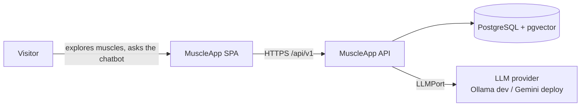
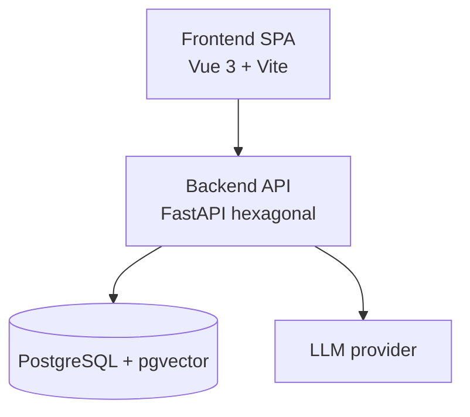

# C4 diagrams

Architecture diagrams following the [C4 model](https://c4model.com/). Add the source
(e.g. Mermaid or Structurizr) and exported images here as the system grows.

## Level 1 — System context (draft)

## Level 2 — Containers (draft)

_TODO: add the component-level (Level 3) diagram for the backend layers._
