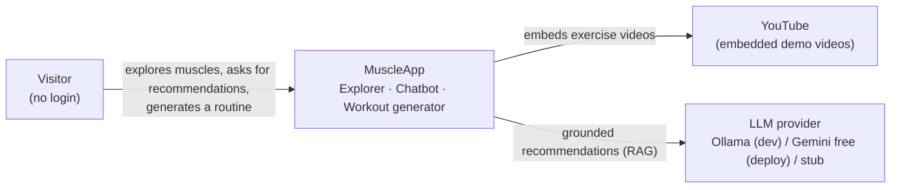
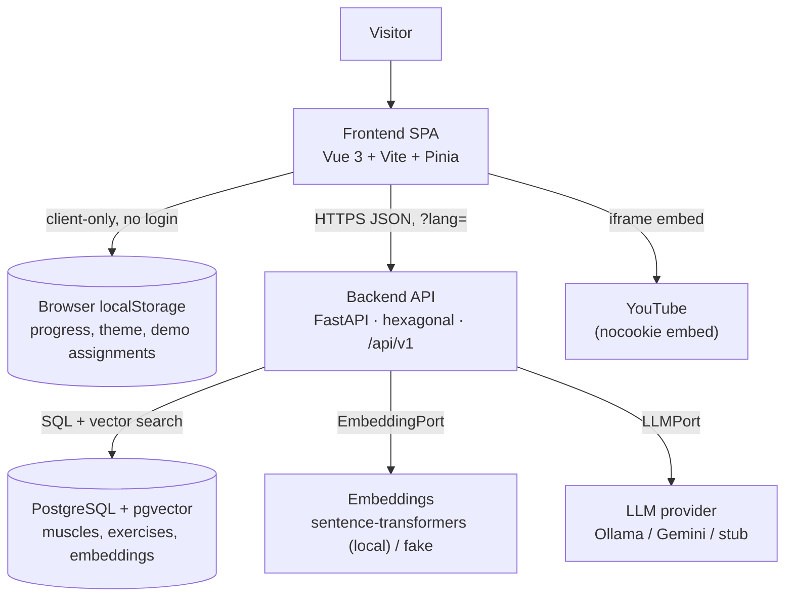
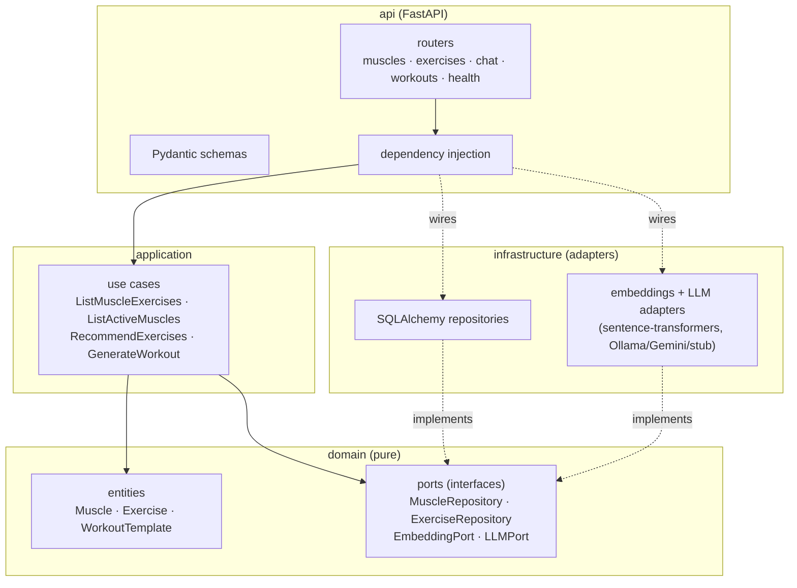

# C4 diagrams

Architecture diagrams following the [C4 model](https://c4model.com/), written in
Mermaid so they render directly on GitHub. Three levels of zoom: system **context**,
**containers**, and backend **components**.

## Level 1 — System context

Who uses the system and what it depends on.

## Level 2 — Containers

The runtime pieces and how they talk.

## Level 3 — Components (backend, hexagonal)

Dependencies point **inwards**: `api` and `infrastructure` depend on `application`
and `domain`; the `domain` depends on nothing external. Adapters (DB, LLM,
embeddings) implement the ports the use cases need, so infrastructure can be swapped
without touching business logic.

> To export images (optional), paste a block into the [Mermaid Live Editor](https://mermaid.live)
> or use the Mermaid CLI. GitHub renders the blocks above without any tooling.
