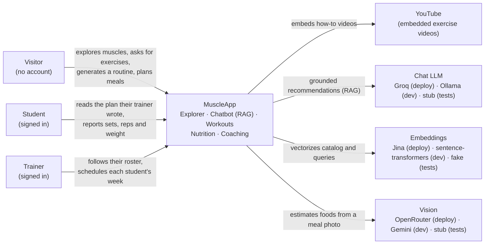
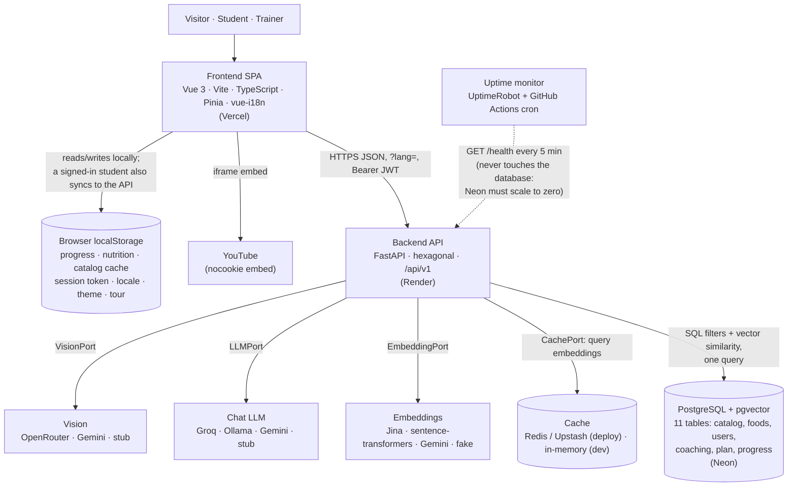
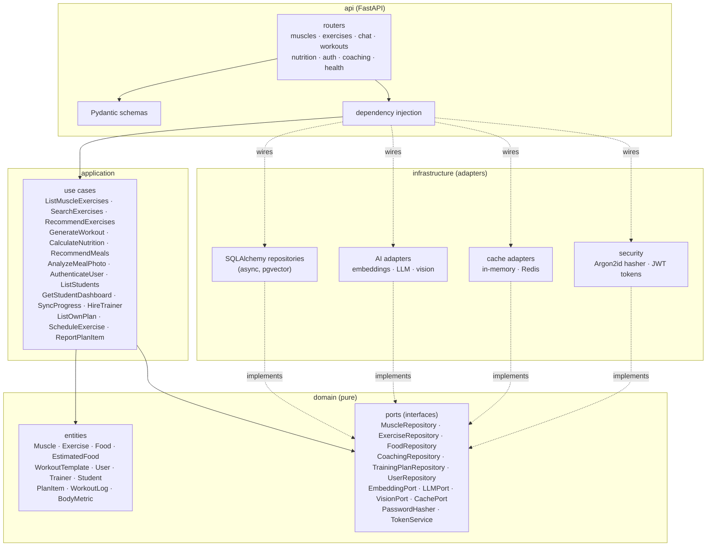

# C4 diagrams

Architecture diagrams following the [C4 model](https://c4model.com/), written in
Mermaid so they render directly on GitHub. Three levels of zoom: system **context**,
**containers**, and backend **components**.

Providers appear as `deploy` / `dev` / `tests`: each one is an adapter behind a port,
chosen with an environment variable (see [ADR-0004](../adr/0004-provider-agnostic-llm.md)),
so the boxes on the right of these diagrams change without the ones on the left moving.

## Level 1 — System context

Who uses the system and what it depends on. The explorer, the chatbot, the workout
generator and the whole nutrition module need no account; signing in only unlocks the
coaching area ([ADR-0021](../adr/0021-coaching-data-and-progress-sync.md)).

```mermaid
graph LR
    visitor["Visitor<br/>(no account)"]
    student["Student<br/>(signed in)"]
    trainer["Trainer<br/>(signed in)"]
    app["MuscleApp<br/>Explorer · Chatbot (RAG) · Workouts<br/>Nutrition · Coaching"]
    yt["YouTube<br/>(embedded exercise videos)"]
    llm["Chat LLM<br/>Groq (deploy) · Ollama (dev) · stub (tests)"]
    emb["Embeddings<br/>Jina (deploy) · sentence-transformers (dev) · fake (tests)"]
    vis["Vision<br/>OpenRouter (deploy) · Gemini (dev) · stub (tests)"]

    visitor -->|"explores muscles, asks for exercises,<br/>generates a routine, plans meals"| app
    student -->|"reads the plan their trainer wrote,<br/>reports sets, reps and weight"| app
    trainer -->|"follows their roster,<br/>schedules each student's week"| app
    app -->|"embeds how-to videos"| yt
    app -->|"grounded recommendations (RAG)"| llm
    app -->|"vectorizes catalog and queries"| emb
    app -->|"estimates foods from a meal photo"| vis
```

## Level 2 — Containers

The runtime pieces and how they talk. Everything on the right is a managed free tier
with no card attached ([ADR-0010](../adr/0010-cost-zero-tooling-and-deploy.md)).

```mermaid
graph TB
    user["Visitor · Student · Trainer"]
    spa["Frontend SPA<br/>Vue 3 · Vite · TypeScript · Pinia · vue-i18n<br/>(Vercel)"]
    ls[("Browser localStorage<br/>progress · nutrition · catalog cache<br/>session token · locale · theme · tour")]
    api["Backend API<br/>FastAPI · hexagonal · /api/v1<br/>(Render)"]
    db[("PostgreSQL + pgvector<br/>11 tables: catalog, foods, users,<br/>coaching, plan, progress<br/>(Neon)")]
    cache[("Cache<br/>Redis / Upstash (deploy) · in-memory (dev)")]
    emb["Embeddings<br/>Jina · sentence-transformers · Gemini · fake"]
    llm["Chat LLM<br/>Groq · Ollama · Gemini · stub"]
    vis["Vision<br/>OpenRouter · Gemini · stub"]
    yt["YouTube<br/>(nocookie embed)"]
    mon["Uptime monitor<br/>UptimeRobot + GitHub Actions cron"]

    user --> spa
    spa -->|"HTTPS JSON, ?lang=, Bearer JWT"| api
    spa -->|"iframe embed"| yt
    spa -->|"reads/writes locally;<br/>a signed-in student also syncs to the API"| ls
    api -->|"SQL filters + vector similarity,<br/>one query"| db
    api -->|"CachePort: query embeddings"| cache
    api -->|"EmbeddingPort"| emb
    api -->|"LLMPort"| llm
    api -->|"VisionPort"| vis
    mon -.->|"GET /health every 5 min<br/>(never touches the database:<br/>Neon must scale to zero)"| api
```

## Level 3 — Components (backend, hexagonal)

Dependencies point **inwards**: `api` and `infrastructure` depend on `application`
and `domain`; the `domain` depends on nothing external. Adapters implement the ports
the use cases need, so a provider can be swapped without touching business logic —
which is what happened when the embeddings moved from Gemini to Jina
([ADR-0019](../adr/0019-embeddings-provider-jina.md)).

```mermaid
graph TB
    subgraph api["api (FastAPI)"]
        routers["routers<br/>muscles · exercises · chat · workouts<br/>nutrition · auth · coaching · health"]
        schemas["Pydantic schemas"]
        deps["dependency injection"]
    end
    subgraph application["application"]
        usecases["use cases<br/>ListMuscleExercises · SearchExercises · RecommendExercises<br/>GenerateWorkout · CalculateNutrition · RecommendMeals<br/>AnalyzeMealPhoto · AuthenticateUser · ListStudents<br/>GetStudentDashboard · SyncProgress · HireTrainer<br/>ListOwnPlan · ScheduleExercise · ReportPlanItem"]
    end
    subgraph domain["domain (pure)"]
        entities["entities<br/>Muscle · Exercise · Food · EstimatedFood<br/>WorkoutTemplate · User · Trainer · Student<br/>PlanItem · WorkoutLog · BodyMetric"]
        ports["ports (interfaces)<br/>MuscleRepository · ExerciseRepository · FoodRepository<br/>CoachingRepository · TrainingPlanRepository · UserRepository<br/>EmbeddingPort · LLMPort · VisionPort · CachePort<br/>PasswordHasher · TokenService"]
    end
    subgraph infrastructure["infrastructure (adapters)"]
        repos["SQLAlchemy repositories<br/>(async, pgvector)"]
        ai["AI adapters<br/>embeddings · LLM · vision"]
        cacheimpl["cache adapters<br/>in-memory · Redis"]
        sec["security<br/>Argon2id hasher · JWT tokens"]
    end

    routers --> deps
    routers --> schemas
    deps --> usecases
    usecases --> ports
    usecases --> entities
    repos -. implements .-> ports
    ai -. implements .-> ports
    cacheimpl -. implements .-> ports
    sec -. implements .-> ports
    deps -. wires .-> repos
    deps -. wires .-> ai
    deps -. wires .-> cacheimpl
    deps -. wires .-> sec
```

## Where the deployment map lives

These three levels stop at the application boundary. How the containers are hosted —
Vercel, Render, Neon and the free-tier providers, plus the keep-alive that stops
Render idling and deliberately lets Neon sleep — is covered in
[ADR-0010](../adr/0010-cost-zero-tooling-and-deploy.md),
[ADR-0014](../adr/0014-continuous-deployment.md) and
[ADR-0015](../adr/0015-performance-caching-and-keepalive.md).

> To export images (optional), paste a block into the [Mermaid Live Editor](https://mermaid.live)
> or use the Mermaid CLI. GitHub renders the blocks above without any tooling.
